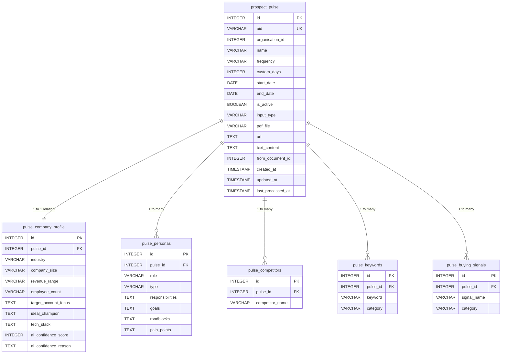

# Database Schema Reference: Prospect Pulse

This document outlines the SQLite schema design, tables, columns, foreign-key relationships, and common SQL JOIN patterns used in the **Prospect Pulse** module.

---

## 1. Visual Entity-Relationship (ER) Diagram



---

## 2. Table Schemas

### 1. `prospect_pulse` (Campaign Configs)
*The root table that stores campaign configuration settings.*

| Column | Type | Constraints | Description |
| :--- | :--- | :--- | :--- |
| `id` | `INTEGER` | `PRIMARY KEY AUTOINCREMENT` | Auto-incrementing internal integer ID. |
| `uid` | `VARCHAR(50)` | `UNIQUE INDEX` | Secure unique Base62 token (e.g. `DbEIwJWmTsm`) used for URLs. |
| `organisation_id`| `INTEGER` | `NOT NULL` | The tenant ID this Pulse configuration belongs to. |
| `name` | `VARCHAR(255)`| `NOT NULL` | Human-readable name of the Pulse. |
| `frequency` | `VARCHAR(20)` | `DEFAULT 'daily'` | Running schedule interval (`daily`, `weekly`, `monthly`, `custom`). |
| `custom_days` | `INTEGER` | `NULL` | Run recurrence in days if frequency is `custom`. |
| `start_date` | `DATE` | `NOT NULL` | Start date of active scanning. |
| `end_date` | `DATE` | `NULL` | Expiration date of active scanning (optional). |
| `is_active` | `BOOLEAN` | `NOT NULL DEFAULT 1` | Status tracker (1 for Active, 0 for Paused). |
| `input_type` | `VARCHAR(20)` | `DEFAULT 'text'` | Source format (`text`, `pdf`, `url`, `icp`). |
| `pdf_file` | `VARCHAR(255)`| `NULL` | Local path of uploaded PDF file. |
| `url` | `TEXT` | `NULL` | Target web URL. |
| `text_content` | `TEXT` | `NULL` | Target manual text contents. |
| `from_document_id`| `INTEGER` | `NULL` | Placeholder for legacy documents link. |
| `created_at` | `TIMESTAMP` | `DEFAULT CURRENT_TIMESTAMP` | Row creation timestamp. |
| `updated_at` | `TIMESTAMP` | `DEFAULT CURRENT_TIMESTAMP` | Row modification timestamp. |

---

### 2. `pulse_company_profile` (Target Account Settings)
*One-to-one relationship holding the Ideal Customer Profile parameters parsed by Gemini.*

| Column | Type | Constraints | Description |
| :--- | :--- | :--- | :--- |
| `id` | `INTEGER` | `PRIMARY KEY AUTOINCREMENT` | Auto-incrementing primary key. |
| `pulse_id` | `INTEGER` | `UNIQUE NOT NULL, FOREIGN KEY` | References `prospect_pulse(id) ON DELETE CASCADE`. |
| `industry` | `VARCHAR(150)`| `NULL` | Targeted industry sector. |
| `company_size` | `VARCHAR(100)`| `NULL` | Headcount description (e.g. `100 - 500 Employees`). |
| `revenue_range` | `VARCHAR(100)`| `NULL` | Revenue estimate (e.g. `$10M - $50M`). |
| `employee_count` | `VARCHAR(100)`| `NULL` | Numeric headcount estimate (e.g. `100-250`). |
| `target_account_focus`| `TEXT` | `NULL` | Comma-separated GTM vertical focus chips. |
| `ideal_champion` | `TEXT` | `NULL` | List of target buying leads roles. |
| `tech_stack` | `TEXT` | `NULL` | Core technologies currently run by targets. |
| `ai_confidence_score`| `INTEGER` | `DEFAULT 90` | AI parsing accuracy confidence percentage. |

---

### 3. `pulse_personas` (Target Buyer Roles)
*One-to-many relationship holding the targeted executive profiles.*

| Column | Type | Constraints | Description |
| :--- | :--- | :--- | :--- |
| `id` | `INTEGER` | `PRIMARY KEY AUTOINCREMENT` | Auto-incrementing primary key. |
| `pulse_id` | `INTEGER` | `NOT NULL, FOREIGN KEY` | References `prospect_pulse(id) ON DELETE CASCADE`. |
| `role` | `VARCHAR(255)`| `NOT NULL` | Exact title of target (e.g. `CISO`, `VP Sales`). |
| `type` | `VARCHAR(100)`| `NULL` | Executive buyer type (`Economic Buyer`, `Technical Champion`). |
| `responsibilities`| `TEXT` | `NULL` | Role core focus. |
| `goals` | `TEXT` | `NULL` | Target operational objectives. |
| `pain_points` | `TEXT` | `NULL` | Comma-separated list of target struggles. |

---

### 4. `pulse_competitors` (Monitored Brands)
*One-to-many relationship mapping direct market threats.*

| Column | Type | Constraints | Description |
| :--- | :--- | :--- | :--- |
| `id` | `INTEGER` | `PRIMARY KEY AUTOINCREMENT` | Primary key. |
| `pulse_id` | `INTEGER` | `NOT NULL, FOREIGN KEY` | References `prospect_pulse(id) ON DELETE CASCADE`. |
| `competitor_name`| `VARCHAR(255)`| `NOT NULL` | Brand name of competitor (e.g., `Epic Systems`). |

---

### 5. `pulse_keywords` (Scraper Search Terms)
*One-to-many mapping of search keywords used by feed engines.*

| Column | Type | Constraints | Description |
| :--- | :--- | :--- | :--- |
| `id` | `INTEGER` | `PRIMARY KEY AUTOINCREMENT` | Primary key. |
| `pulse_id` | `INTEGER` | `NOT NULL, FOREIGN KEY` | References `prospect_pulse(id) ON DELETE CASCADE`. |
| `keyword` | `VARCHAR(255)`| `NOT NULL` | Keyword string (e.g., `Clinical workflows`). |
| `category` | `VARCHAR(100)`| `NOT NULL` | Grouping (`Primary Discovery` or `Secondary Discovery`). |

---

### 6. `pulse_buying_signals` (Triggers)
*One-to-many mapping of market triggers (Organizational, Tech, Business).*

| Column | Type | Constraints | Description |
| :--- | :--- | :--- | :--- |
| `id` | `INTEGER` | `PRIMARY KEY AUTOINCREMENT` | Primary key. |
| `pulse_id` | `INTEGER` | `NOT NULL, FOREIGN KEY` | References `prospect_pulse(id) ON DELETE CASCADE`. |
| `signal_name` | `VARCHAR(255)`| `NOT NULL` | Name of signal trigger (e.g., `Leadership Changes`). |
| `category` | `VARCHAR(100)`| `NOT NULL` | Trigger category (`Organizational`, `Technology`, `Business`). |

---

## 3. Common SQL JOINS

When writing integrations or downstream feed matching engines, here are the standard JOIN query patterns:

### Fetching a Full GTM Campaign Profile
To fetch a Pulse configuration alongside its Ideal Customer Profile (ICP) parameters:
```sql
SELECT 
    p.id, 
    p.uid, 
    p.name, 
    c.industry, 
    c.company_size, 
    c.revenue_range, 
    c.target_account_focus
FROM prospect_pulse p
INNER JOIN pulse_company_profile c ON p.id = c.pulse_id
WHERE p.uid = 'DbEIwJWmTsm' AND p.organisation_id = 1;
```

### Retrieving Search Keywords & Target Competitors for Scrapers
To fetch active search keywords:
```sql
SELECT k.keyword, k.category 
FROM pulse_keywords k
INNER JOIN prospect_pulse p ON k.pulse_id = p.id
WHERE p.id = 12 AND p.is_active = 1;
```
